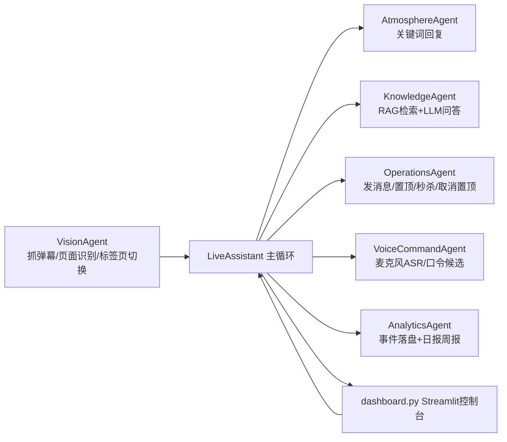

# AI 直播助手（TikTok Live / TikTok Shop 多智能体助播系统）

这是一个面向 TikTok 直播场景的自动化助播项目，目标是替代人工助播的大部分重复动作：

- 实时监听弹幕并自动回复
- 结合知识库（RAG）回答问题
- 自动发送暖场话术
- 通过语音口令触发运营动作（置顶链接、取消置顶、秒杀活动上架）
- 记录弹幕事件并自动生成日报/周报
- 提供本地 Mock 测试页、语音压测工具、系统自检、Windows EXE 打包能力

项目定位是“可运行、可观测、可排障、可上线”，而不是仅演示算法。

---

## 1. 项目目标与适用场景

### 1.1 适用场景

- TikTok 直播间（`/@xxx/live`）弹幕助播
- TikTok Shop 助播控制台（`shop.tiktok.com/streamer/live/product/dashboard`）运营动作自动执行
- 无真实助播账号时，通过内置 Mock 页面进行离线联调和压测

### 1.2 主要能力

1. 弹幕感知：实时抓取新弹幕，去重，过滤系统噪声。
2. 回复决策：关键词优先，问题类再走知识库/LLM，带多级去重与冷却。
3. 运营执行：DOM 优先 + 回执校验，避免“点了但没生效”。
4. 语音触发：本地麦克风采集 + Python ASR（可选 web speech），支持中英文口令。
5. 数据分析：弹幕事件持续落盘，自动生成日报与周报，并在控制台图表展示。
6. 上线交付：支持 Windows EXE 打包与开箱运行。

### 1.3 当前默认策略（非常重要）

- 本地优先（`LOCAL_FIRST_MODE=true`）：优先走本地 ASR、本地 Embedding，减少云依赖。
- 语音默认模式：`python_asr`（系统麦克风权限）而不是网页权限模式。
- 统一语言输出：回复/暖场/知识库回答都统一按“统一语言”输出。

---

## 2. 系统架构（代码真实对应）



### 2.1 核心运行流

1. `LiveAssistant.start()` 启动时先确保浏览器连接。
2. 后台线程 `_run_loop()` 周期执行：
   - `_poll_voice_commands()` 轮询语音候选并执行口令动作
   - `vision.get_new_danmu()` 拉取弹幕
   - `handle_message()` 处理最新弹幕（高峰只处理部分）
   - `_maybe_send_proactive_message()` 暖场
   - `_maybe_generate_reports()` 自动报表
3. 所有关键事件写入：
   - 内存实时面板（运行监控）
   - `logs/app.log`
   - `data/analytics/danmu_events.jsonl`

---

## 3. 目录结构（重点文件）

```text
/Users/han/Desktop/直播项目
├── main.py                       # 主流程编排（LiveAssistant）
├── dashboard.py                  # Streamlit 控制台
├── app_launcher.py               # EXE 入口（运行时目录与自动打开控制台）
├── app_config/
│   └── settings.py               # 全量配置（含 .env 轻量加载）
├── agents/
│   ├── vision_agent.py           # 浏览器连接、标签页评分、弹幕抓取
│   ├── operations_agent.py       # 发消息、置顶/取消置顶/秒杀动作 + 回执校验
│   ├── voice_command_agent.py    # Python ASR/Web Speech 双模式
│   ├── knowledge_agent.py        # RAG检索、知识导入、统一语言输出
│   ├── analytics_agent.py        # 事件分析、日报周报、图表数据
│   └── atmosphere_agent.py       # 关键词回复
├── scripts/
│   ├── dashboard_service.py      # 控制台服务启停/重启/日志
│   ├── voice_stress_pack.py      # 语音离线压测 + 日志复盘
│   ├── loopback_asr_real_test.py # 回采模式真实链路压测
│   ├── voice_audio_runner.py     # 语音样本生成与播放（Win/mac）
│   ├── mock_shop_server.py       # 本地 Mock 页面 HTTP 服务
│   ├── build_windows_exe.ps1     # Windows 打包脚本
│   └── build_windows_exe.bat
├── stress/
│   ├── mock_shop/mock_tiktok_shop.html   # 高仿 TikTok Shop 助播页面
│   └── voice/                             # 语音压测样本与脚本
├── docs/
│   ├── USER_GUIDE.md
│   └── WINDOWS_EXE_BUILD.md
├── data/                         # 运行数据（知识库、报表、状态）
├── logs/                         # app.log、streamlit.out
├── run/                          # PID 文件
├── requirements.txt
├── requirements-local.txt
├── .env.example
└── windows_exe.spec
```

---

## 4. 环境要求

### 4.1 软件要求

- Python 3.9+（建议 3.10/3.11）
- Chrome 或 Edge（支持 remote debugging）
- macOS / Windows（代码已做双平台兼容）

### 4.2 可选依赖（本地语音增强）

- `openai-whisper`
- `pocketsphinx`
- `soundfile`
- Windows：`PyAudio`
- macOS：建议安装 `portaudio`

---

## 5. 安装与初始化

### 5.1 创建虚拟环境并安装

```bash
# macOS / Linux
python -m venv .venv
source .venv/bin/activate
pip install -U pip
pip install -r requirements.txt
```

Windows PowerShell：

```powershell
py -3 -m venv .venv
.\.venv\Scripts\Activate.ps1
python -m pip install -U pip
python -m pip install -r requirements.txt
```

若要尽量本地化（推荐）：

```bash
pip install -r requirements.txt -r requirements-local.txt
```

### 5.2 准备 `.env`

```bash
cp .env.example .env
```

Windows PowerShell：

```powershell
Copy-Item .env.example .env
```

最小必填（启用远端 LLM 时）：

```env
LLM_API_KEY=your_key
LLM_BASE_URL=https://api.deepseek.com
LLM_MODEL_NAME=deepseek-chat
```

---

## 6. 启动方式

### 6.1 推荐：服务化启动控制台

```bash
python scripts/dashboard_service.py start
python scripts/dashboard_service.py status
python scripts/dashboard_service.py logs
```

常用运维命令：

```bash
python scripts/dashboard_service.py restart --force-port
python scripts/dashboard_service.py stop --force-port
python scripts/dashboard_service.py ensure
```

默认访问：`http://127.0.0.1:8501`

### 6.2 直接启动 Streamlit（开发调试）

```bash
python -m streamlit run dashboard.py --server.port 8501 --server.address 127.0.0.1 --server.fileWatcherType none
```

### 6.3 直接启动主监听（不经控制台）

```bash
python main.py
```

---

## 7. 浏览器连接机制（关键）

系统通过 DevTools 端口连接浏览器，默认 `9222`。

### 7.1 手动启动调试浏览器

macOS：

```bash
"/Applications/Google Chrome.app/Contents/MacOS/Google Chrome" --remote-debugging-port=9222 --user-data-dir="$(pwd)/user_data"
```

Windows：

```powershell
& "C:\Program Files\Google\Chrome\Application\chrome.exe" --remote-debugging-port=9222 --user-data-dir="$PWD\user_data"
```

Windows CMD：

```bat
"C:\Program Files\Google\Chrome\Application\chrome.exe" --remote-debugging-port=9222 --user-data-dir="%cd%\user_data"
```

### 7.2 自动连接规则

- `VisionAgent` 会扫描所有标签页并打分选择目标页。
- 支持识别：
  - TikTok 直播间页
  - TikTok Shop 助播页
  - 内置 Mock 页面
- 强降权页面：Google 搜索页、新标签页、`localhost:8501` 控制台页等。

---

## 8. 控制台操作流程（建议按此顺序）

1. 左侧点击“连接浏览器”或“启动监听”（会自动连）。
2. 点击“申请麦克风权限”（Python ASR 模式是系统权限，不是网页权限）。
3. 打开“启动监听”。
4. 点击“运行系统自检”。
5. 在“运行监控”观察：
   - 实时语音输入
   - 实时弹幕流
   - 系统日志

---

## 9. 统一语言策略（输出强约束）

- 统一语言会同时作用于：
  - 自动回复
  - 自动暖场
  - 知识库问答
- 即使知识库文本、语气模板、用户提问是其他语言，最终输出按统一语言。
- 语气模板只提取“风格”，不改变最终语言目标。

对应实现：`KnowledgeAgent.ensure_output_language()` + `LiveAssistant._enforce_unified_output_language()`。

---

## 10. 弹幕回复链路

### 10.1 决策顺序

1. 自身回声过滤（防止自己发的消息被再次处理）。
2. 重复弹幕过滤。
3. 优先判断是否是运营口令（来自允许用户）。
4. 若启用自动回复：
   - 先走关键词回复（快）
   - 再对问题类弹幕调用知识库/LLM（有频率限制）
5. 回复前再做“重复回复过滤”。

### 10.2 高峰策略

- 每轮最多处理 `MAX_MESSAGES_PER_CYCLE` 条。
- 多条时优先最新弹幕，只有第一条允许 LLM，降低延迟。

---

## 11. 语音链路（最常见问题区）

### 11.1 模式说明

- `python_asr`（默认，推荐）：
  - 本地麦克风采集 + Python ASR
  - 只依赖系统麦克风权限
  - 不依赖 TikTok 网页的麦克风站点权限

- `system_loopback_asr`（本机直采网页声音）：
  - 从系统回采输入设备读取浏览器播放音频（如 BlackHole/Stereo Mix/VB-CABLE）
  - 不走物理麦克风
  - 仍走 Python ASR 命令解析链路

- `web_speech`：
  - 浏览器 Web Speech API
  - 依赖当前网页安全上下文和站点授权

### 11.2 ASR Provider

- `whisper_local`：本地识别，稳定，适合中文
- `dashscope_funasr`：阿里云 FunASR（实时云端识别，需配置 API Key）
- `google`：在线识别，依赖网络
- `auto`：按语言与本地优先策略动态链路
- `sphinx`：离线英文兜底

### 11.3 语音口令识别与执行

链路：

1. `VoiceCommandAgent.collect_command_candidates()` 获取候选语音文本
2. `LiveAssistant._parse_operation_command_text()` 解析为动作
3. `LiveAssistant._execute_operation_command()` 调用 OperationsAgent
4. 操作完成后写入语音输入流与动作回执

### 11.4 当前支持动作

- 置顶 N 号链接：`pin_product`
- 取消 N 号置顶：`unpin_product`
- 上架秒杀活动：`start_flash_sale`

### 11.5 常见中英口令（示例）

中文：

- 助播，将 3 号链接置顶
- 助播，取消 1 号链接置顶
- 助播，秒杀活动上架

英文：

- assistant pin link three
- assistant unpin link one
- assistant launch flash sale

> 系统内置了大量同音/误识别归一化规则（例如 `to/too/two`、`launch/lounge/lanch` 等）。

### 11.6 为什么显示 running 但没动作

优先检查：

1. 主监听是否运行（不是仅麦克风测试）。
2. 语音文本是否命中命令解析（看“最新输入 status/note/command”）。
3. 当前页面是否可执行页（Shop dashboard，而不是 overview）。
4. 是否被去重冷却（同文本或同动作）。

---

## 12. 运营动作稳定性设计

### 12.1 页面门禁

执行前会调用 `VisionAgent.ensure_action_page(action)`：

- 只在可操作页面执行（`shop_dashboard`）
- 监控页（`shop_overview`）不执行运营动作

### 12.2 DOM 优先 + 回执校验

每个动作采用：

1. DOM 定位按钮并点击
2. 轮询检测成功回执（toast/按钮状态/行状态）
3. 必要时重连后重试一次

避免“点击成功但实际上未生效”。

### 12.3 回执信息

`OperationsAgent.last_action_receipt` 包含：

- `action`
- `ok`
- `stage`
- `reason`
- `detail`
- `ts`

运行监控页可直接看到动作回执字段。

---

## 13. 知识库（RAG）与问答

### 13.1 支持文件类型

- `.txt`
- `.xlsx`

导入入口：控制台 `🧠 知识库调试`。

### 13.2 检索策略

1. 优先向量检索（Chroma + Embedding）
2. 向量不够时混入关键词检索
3. 若向量不可用，回退关键词检索
4. 远端 LLM 不可用时，从上下文抽句兜底回答

### 13.3 本地优先 Embedding

- 默认本地 HuggingFace（`EMBEDDING_LOCAL_FILES_ONLY=true`）
- 可关闭离线强制并允许在线回退
- 极端情况下降级 `HashEmbeddings` 保证主流程不停

---

## 14. 数据分析与报表

### 14.1 事件数据落盘

文件：`data/analytics/danmu_events.jsonl`

字段包含：

- `timestamp`
- `user`
- `text`
- `status`
- `reply`
- `action`
- `language`
- `llm_candidate`
- `processing_ms`

### 14.2 控制台图表（数据报表页）

- 周期指标卡：弹幕量、用户数、回复率、提问占比、平均耗时、P90
- 趋势：按天消息/回复/提问折线
- 结构分布：时段、意图、用户类型、状态、语言
- 高频问题与关键用户表
- 自动生成建议

### 14.3 报告生成

- 今日日报
- 昨日日报
- 本周周报
- 上周周报

输出目录：

- `data/reports/daily/`
- `data/reports/weekly/`

自动生成开关：`ANALYTICS_AUTO_REPORT_ENABLED=true`

---

## 15. 内置 Mock 测试页（离线联调核心）

### 15.1 两种接入方式

1. 控制台按钮：`🧪 打开模拟网页测试`（推荐，自动接入并尝试启动监听）
2. 独立 HTTP 服务：

```bash
python scripts/mock_shop_server.py --host 127.0.0.1 --port 9100
```

### 15.2 Mock 地址

- 控制台（未开播）：
  `http://127.0.0.1:9100/streamer/live/product/dashboard?mock_tiktok_shop=1&view=dashboard_idle`
- 控制台（开播）：
  `http://127.0.0.1:9100/streamer/live/product/dashboard?mock_tiktok_shop=1&view=dashboard_live`
- 大屏（监控页）：
  `http://127.0.0.1:9100/workbench/live/overview?mock_tiktok_shop=1`

### 15.3 Mock 行为要点

- `dashboard_idle`：未开播，置顶/秒杀受限
- `dashboard_live`：可置顶、可取消置顶、可上架秒杀
- `overview`：监控页，只看数据不执行运营动作

---

## 16. 语音压测（强烈建议上线前执行）

### 16.1 离线口令解析压测

```bash
python scripts/voice_stress_pack.py offline --profile quick --json
python scripts/voice_stress_pack.py offline --profile all --json
```

### 16.2 日志复盘

```bash
python scripts/voice_stress_pack.py log-scan --minutes 30
```

### 16.3 macOS 语音样本生成/播放

```bash
bash stress/voice/macos_tts_generate.sh quick
bash stress/voice/macos_playback_loop.sh quick 2 2
```

### 16.4 Windows 语音样本生成/播放

```powershell
powershell -ExecutionPolicy Bypass -File stress/voice/windows_tts_generate.ps1 -Profile quick
powershell -ExecutionPolicy Bypass -File stress/voice/windows_playback_loop.ps1 -Rounds 2 -GapSeconds 2
```

### 16.5 控制台一键压测

`📈 数据报表` 页底部：`🚀 一键跑本地语音压测`。

### 16.6 回采模式真实链路压测（新增）

```bash
python scripts/loopback_asr_real_test.py --profile quick --mode system_loopback_asr --json
python scripts/loopback_asr_real_test.py --profile quick --mode tab_audio_asr --json
```

- 真实覆盖：音频播放 -> loopback 回采 -> VAD/RMS 门控 -> ASR provider 链 -> `_local_push_text()` -> 命令执行链。
- 输出报告：`data/reports/voice_stress/loopback_real_*.{md,json}`

### 16.7 全局功能测试（新增）

```bash
python scripts/global_feature_test.py --profile full
```

- `full`：强制覆盖 EXE 启动链路、Mock 联调、语音链路、运营动作、知识库、报表等核心功能，并包含 loopback 真实链路压测。
- `offline`：仅离线验证（不跑浏览器与麦克风端到端）。

输出报告：

- `data/reports/global_feature_test/*.json`
- `data/reports/global_feature_test/*.md`

---

## 17. Windows EXE 打包与上线

在 Windows 上执行：

```powershell
powershell -ExecutionPolicy Bypass -File .\scripts\build_windows_exe.ps1
```

若需将本地模型一并打包并安装本地增强依赖：

```powershell
powershell -ExecutionPolicy Bypass -File .\scripts\build_windows_exe.ps1 `
  -IncludeLocalDeps `
  -EmbeddingModelDir "D:\models\embedding_model" `
  -WhisperModelDir "D:\models\whisper_cache"
```

产物：

- `dist/AI_Live_Assistant/AI_Live_Assistant.exe`
- `dist/AI_Live_Assistant/启动助手.bat`

打包脚本会优先复制根目录 `.env`（若不存在则复制 `.env.example`），并按配置自动带入模型目录。
同时会在发布包内 `.env` 缺失时补齐语音回采默认项（`VOICE_COMMAND_INPUT_MODE=system_loopback_asr` 等），并补齐 FunASR 备用通道基础项（`VOICE_ASR_ALLOW_DASHSCOPE_FALLBACK`/`VOICE_DASHSCOPE_MODEL`/`VOICE_DASHSCOPE_SAMPLE_RATE`）。
首次上线需确认：`dist/AI_Live_Assistant/.env`

详细见：`docs/WINDOWS_EXE_BUILD.md`

---

## 18. 全量 `.env` 参数参考

> 建议先用 `.env.example`，再按需调整。以下按模块分组。

### 18.1 本地优先与 LLM

- `LOCAL_FIRST_MODE`：本地优先总开关（默认 `true`）
- `LLM_REMOTE_ENABLED`：是否启用远端 LLM
- `LLM_API_KEY`
- `LLM_BASE_URL`
- `LLM_MODEL_NAME`

### 18.2 浏览器连接与标签页策略

- `BROWSER_PORT`
- `USER_DATA_PATH`
- `CHROME_EXECUTABLE`
- `STARTUP_CONNECT_RETRIES`
- `STARTUP_CONNECT_RETRY_INTERVAL_SECONDS`
- `STARTUP_THREAD_READY_TIMEOUT_SECONDS`
- `TIKTOK_FORCE_LIVE_TAB`
- `TIKTOK_TAB_MIN_SCORE`
- `TIKTOK_TAB_REQUIRED_KEYWORDS`
- `TIKTOK_TAB_EXCLUDE_KEYWORDS`

### 18.3 Mock 连接

- `MOCK_SHOP_AUTO_CONNECT`
- `MOCK_SHOP_DEFAULT_VIEW`
- `MOCK_SHOP_CONNECT_RETRIES`
- `MOCK_SHOP_CONNECT_RETRY_INTERVAL_SECONDS`

### 18.4 回复节奏与主循环

- `REPLY_INTERVAL_SECONDS`
- `LLM_REQUEST_TIMEOUT_SECONDS`
- `LLM_MIN_INTERVAL_SECONDS`
- `MAX_MESSAGES_PER_CYCLE`
- `MAIN_LOOP_BUSY_INTERVAL_SECONDS`
- `MAIN_LOOP_IDLE_INTERVAL_SECONDS`
- `MAIN_LOOP_ERROR_BACKOFF_SECONDS`
- `NO_CHAT_WARN_INTERVAL_ROUNDS`
- `NO_CHAT_FORCE_RECONNECT_ROUNDS`

### 18.5 RAG / Embedding

- `EMBEDDING_MODEL_NAME`
- `EMBEDDING_LOCAL_FILES_ONLY`
- `EMBEDDING_ENABLE_ONLINE_FALLBACK`
- `EMBEDDING_CACHE_DIR`
- `HF_HUB_ETAG_TIMEOUT_SECONDS`
- `HF_HUB_DOWNLOAD_TIMEOUT_SECONDS`
- `RAG_CHUNK_SIZE`
- `RAG_CHUNK_OVERLAP`
- `RAG_RETRIEVAL_K`
- `RAG_RETRIEVAL_FETCH_K`
- `RAG_MIN_RELEVANCE_SCORE`

### 18.6 运营口令用户与回声过滤

- `COMMAND_ALLOWED_USERS`
- `SELF_USERNAMES`
- `SELF_ECHO_IGNORE_ENABLED`
- `SELF_ECHO_TTL_SECONDS`
- `SELF_ECHO_MIN_CHARS`

### 18.7 语音口令（总览）

- `VOICE_COMMAND_ENABLED`
- `VOICE_COMMAND_INPUT_MODE`
- `VOICE_COMMAND_POLL_INTERVAL_SECONDS`
- `VOICE_COMMAND_COOLDOWN_SECONDS`
- `VOICE_SUBTITLE_FALLBACK_ENABLED`
- `VOICE_COMMAND_SILENCE_RESTART_SECONDS`
- `VOICE_COMMAND_HEALTH_LOG_INTERVAL_SECONDS`
- `VOICE_COMMAND_FORCE_RESTART_MIN_SECONDS`
- `VOICE_COMMAND_FALLBACK_LANGUAGES`
- `VOICE_COMMAND_CROSS_LANGUAGE_ENABLED`
- `VOICE_COMMAND_CROSS_LANGUAGE_ORDER`
- `VOICE_COMMAND_MAX_LANGS`
- `VOICE_COMMAND_WAKE_WORDS`
- `VOICE_STRICT_WAKE_WORD`

### 18.8 Python ASR 专项

- `VOICE_PYTHON_ASR_PROVIDER`
- `VOICE_ASR_ALLOW_GOOGLE_FALLBACK`
- `VOICE_ASR_ALLOW_DASHSCOPE_FALLBACK`
- `VOICE_PYTHON_ASR_QUEUE_MAX`
- `VOICE_PYTHON_LISTEN_TIMEOUT_SECONDS`
- `VOICE_PYTHON_PHRASE_TIME_LIMIT_SECONDS`
- `VOICE_PYTHON_AMBIENT_ADJUST_SECONDS`
- `VOICE_PYTHON_ENERGY_THRESHOLD`
- `VOICE_PYTHON_DYNAMIC_ENERGY`
- `VOICE_PYTHON_NO_TEXT_WARN_RMS`
- `VOICE_PYTHON_MIC_DEVICE_INDEX`
- `VOICE_PYTHON_MIC_DEVICE_NAME_HINT`
- `VOICE_LOOPBACK_DEVICE_INDEX`
- `VOICE_LOOPBACK_DEVICE_NAME_HINT`
- `VOICE_DASHSCOPE_API_KEY`
- `VOICE_DASHSCOPE_MODEL`
- `VOICE_DASHSCOPE_SAMPLE_RATE`
- `VOICE_DASHSCOPE_BASE_WEBSOCKET_API_URL`
- `VOICE_DASHSCOPE_LANGUAGE_HINTS`
- `VOICE_DASHSCOPE_ENABLE_PUNCTUATION`
- `VOICE_DASHSCOPE_DISABLE_ITN`
- `VOICE_WHISPER_MODEL`
- `VOICE_WHISPER_DOWNLOAD_ROOT`
- `VOICE_WHISPER_MAX_LANGS`

### 18.9 自动暖场与报表

- `ANALYTICS_AUTO_REPORT_ENABLED`
- `ANALYTICS_REPORT_CHECK_INTERVAL_SECONDS`
- `DASHBOARD_HOST`
- `DASHBOARD_PORT`
- `DASHBOARD_AUTO_OPEN`

---

## 19. 性能优化建议（落地配置）

### 19.1 低延迟推荐配置

```env
LOCAL_FIRST_MODE=true
VOICE_COMMAND_INPUT_MODE=python_asr
VOICE_PYTHON_ASR_PROVIDER=whisper_local
VOICE_WHISPER_MAX_LANGS=1
VOICE_ASR_ALLOW_GOOGLE_FALLBACK=false
VOICE_ASR_ALLOW_DASHSCOPE_FALLBACK=false
EMBEDDING_LOCAL_FILES_ONLY=true
EMBEDDING_ENABLE_ONLINE_FALLBACK=false
MAIN_LOOP_BUSY_INTERVAL_SECONDS=0.16
MAIN_LOOP_IDLE_INTERVAL_SECONDS=0.32
MAX_MESSAGES_PER_CYCLE=3
```

### 19.2 首次冷启动慢的原因

- Whisper 模型首次加载
- Embedding 模型首次加载
- 浏览器调试端口未就绪导致重试

系统已有异步预热：

- `LiveAssistant._prewarm_local_runtime()`

---

## 20. 常见故障排查（按症状）

### 20.1 控制台显示“浏览器未连接”

排查顺序：

1. 检查 `9222` 端口是否可用
2. 确认当前 Chrome 里有 TikTok 目标页或 Mock 页
3. 点击“连接浏览器”或“强制重载系统”
4. 看日志 `logs/app.log` 中 `connect_browser` 相关错误

### 20.2 语音 `running` 但“最近输入无文本”

排查顺序：

1. 输入设备是否正确（左侧“输入设备”）
2. 录音测试 RMS 是否有值
3. 是否离麦克风过远/环境噪声高
4. `VOICE_WHISPER_MAX_LANGS` 是否过大导致慢
5. 看日志中是否连续 `no_text` / `asr_error`

### 20.3 说了命令但不执行动作

排查顺序：

1. 看“最新输入”中的 `status` / `note` / `command`
2. 当前页面是否 `shop_dashboard` 可执行页
3. 是否被重复动作冷却
4. 是否处于未开播状态（秒杀上架受限）

### 20.4 秒杀上架失败

常见原因：

- 当前未开播
- 当前没有已置顶商品
- 当前在 overview 监控页而非 dashboard 控制台页

### 20.5 LLM 离线

- 未配置 `LLM_API_KEY`
- `LLM_REMOTE_ENABLED=false`
- 网络不可用

系统会回退本地检索/规则，不会导致主流程停机。

---

## 21. 日志与观测

### 21.1 日志文件

- 主日志：`logs/app.log`
- Streamlit 服务日志：`logs/streamlit.out`

### 21.2 控制台观测面板

- 顶部状态区（1秒刷新）
- 实时语音输入流
- 实时弹幕流
- 系统日志尾部

### 21.3 自检覆盖项

`✅ 系统自检` 包含：

- Local First 配置
- LLM Key 与运行态
- Embedding 离线策略
- 浏览器连接
- 统一语言合法性
- 语音本地链路
- 口令解析（中英文样例）
- 口令解析性能冒烟
- 唤醒词逻辑
- 严格/宽松门控
- 发送文本清洗
- 状态持久化写入

---

## 22. 运行数据与清理建议

### 22.1 重要运行文件

- `data/runtime_state.json`：保存语言/语气/开关/麦克风偏好
- `data/local_knowledge_chunks.json`：本地知识片段
- `data/chroma_db/`：向量库
- `data/reports/`：报表
- `logs/`：日志
- `user_data/`：浏览器 profile（可能很大）

### 22.2 建议纳入忽略/不打包内容

- `user_data/Default/Cache/*`
- 大体积视频素材
- 历史压测产物（可按需保留）

---

## 23. 安全与部署建议

1. 不要把真实 API Key 提交到 Git。
2. 线上机器单独维护 `.env`。
3. 对外演示时建议使用测试账号和 mock 页面。
4. 对真实店播执行动作前先通过系统自检。

---

## 24. 快速检查清单（上线前）

- [ ] `.env` 已配置，且 `LOCAL_FIRST_MODE=true`
- [ ] 浏览器调试端口正常
- [ ] 控制台显示：浏览器已连接
- [ ] 麦克风录音测试有 RMS
- [ ] 语音口令可触发置顶/取消置顶/秒杀上架
- [ ] 报表页可刷新并能生成日报
- [ ] `scripts/voice_stress_pack.py offline --profile quick --json` 通过
- [ ] `scripts/loopback_asr_real_test.py --profile quick --mode system_loopback_asr --json` 通过
- [ ] `scripts/global_feature_test.py --profile full` 通过
- [ ] 自检通过率满足预期

---

## 25. 相关文档

- 使用说明：`/Users/han/Desktop/直播项目/docs/USER_GUIDE.md`
- Windows 打包说明：`/Users/han/Desktop/直播项目/docs/WINDOWS_EXE_BUILD.md`

---

## 26. 一句话总结

这是一个“可实战”的直播助播系统：有主链路、有回退、有自检、有报表、有 mock、有压测、有打包；推荐先在 Mock 完整打通，再切到真实 TikTok 页面上线。
